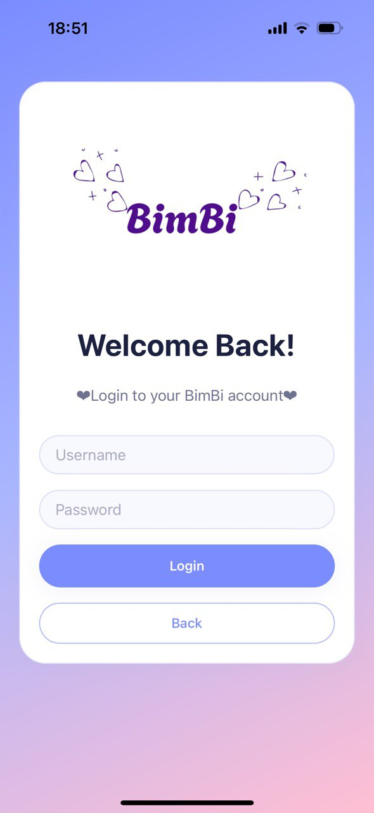
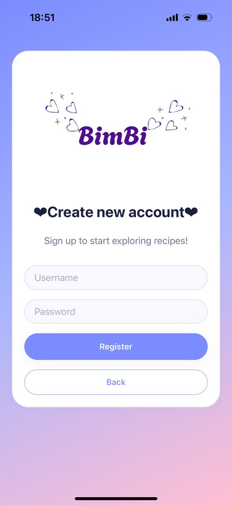
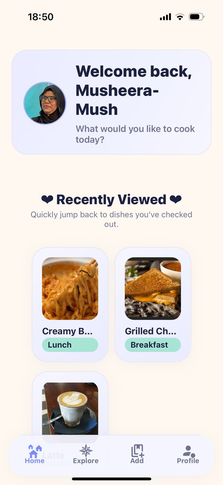

# BimBi – Recipe App

BimBi is a **mobile recipe application** designed to help users explore, create, and enjoy a wide variety of recipes. It provides an intuitive interface for managing personal recipes, browsing community submissions, and organising cooking ideas through tags and user profiles.

---

##  Features

### User Accounts
* Register a new account
* Log in and log out
* Update profile details, including **profile picture** and **display name**

### Recipe Management
* Add new recipes with:
    * **Title**
    * **Description**
    * **Ingredients**
    * **Instructions**
    * **Recipe image**
    * **Tags** (e.g., breakfast, dessert, dinner)
* View recently viewed recipes
* View and edit your own **recipe gallery**

### Explore
* Explore publicly posted recipes from all users
* Filter and browse recipes using predefined tags
* View detailed recipe pages

---

##  Technology Stack

* **Expo Go** (for running the mobile application)
* **TypeScript** (.tsx files)
* **React Native** framework (via Expo)
* **AsyncStorage** (for saving local data, depending on implementation)
* **Expo Image Picker** (for selecting images)
* **Expo Linear Gradient** (for UI gradients)
* **react-native-dotenv** (for managing environment variables)

> **Note:** Expo uses React Native under the hood, so yes — you ARE using React Native even if you didn’t install it separately.

---

## How to Run the App

1. Clone the repository:
    ```bash
    git clone https://github.com/Aishath-Musheera-22/BimBi.git
    cd BimBi
    ```
2. Ensure **Node.js** and **npm** are installed.
3. Install Expo CLI (optional):
    ```bash
    npm install --global expo-cli
    ```
4. Install project dependencies:
    ```bash
    npm install
    ```
5. Install additional dependencies:
    ```bash
    npx expo install @react-native-async-storage/async-storage
    expo install expo-image-picker
    npx expo install expo-linear-gradient
    npm install react-native-dotenv
    ```
6. Start the development server:
    ```bash
    npx expo start
    ```
7. Scan the QR code using the **Expo Go** app on your phone.

---

##  Project Structure (Short Overview)

* `/app` – Screens and navigation
* `/components` – Reusable UI components
* `/context` – User and recipe state management
* `/assets` – Images and static resources
* `App.tsx` – Entry point of the application

---

##  User Testing

A separate **User Testing Document** has been completed, containing:
* Test cases
* Participant feedback
* Observed usability issues
* Final adjustments made to the app

This supports the evaluation of the app’s functionality and user experience.

---

##  Future Improvements

* Add **search functionality**
* Allow **sorting** by cooking time or difficulty
* Add **personalised recommendations**
* Add **dark/light mode** settings
* Enable **in-app notifications** for new recipe updates

---

##  Usability Issues Identified

| Issue Identified            | User Feedback                                      | Proposed Solution                                           |
|-----------------------------|----------------------------------------------------|--------------------------------------------------------------|
| Edit icon too small         | “I didn’t notice the pencil icon at first.”       | Increase icon size and add a textual label.                 |
| No delete confirmation      | “I deleted a recipe by mistake.”                  | Add a confirmation modal before deletion.                   |
| Image upload feedback       | “I wasn’t sure if my image uploaded.”             | Show a progress indicator and confirmation message.         |
| Recently viewed resets      | “My recently viewed recipes disappear sometimes.” | Ensure state persists after app restarts.                   |


---

## Screenshots
<table>
  <tr>
    <td>
      <div style="display:flex; flex-direction:column; align-items:center; border:1px solid #e0e0e0; border-radius:10px; padding:8px; margin:8px; background:#ffffff;">
        
        <div style="margin-top:6px; font-size:14px; font-weight:600;">Splash</div>
      </div>
    </td>
    <td>
      <div style="display:flex; flex-direction:column; align-items:center; border:1px solid #e0e0e0; border-radius:10px; padding:8px; margin:8px; background:#ffffff;">
        
        <div style="margin-top:6px; font-size:14px; font-weight:600;">Main</div>
      </div>
    </td>
    <td>
      <div style="display:flex; flex-direction:column; align-items:center; border:1px solid #e0e0e0; border-radius:10px; padding:8px; margin:8px; background:#ffffff;">
        
        <div style="margin-top:6px; font-size:14px; font-weight:600;">Login</div>
      </div>
    </td>
  </tr>
  <tr>
    <td>
      <div style="display:flex; flex-direction:column; align-items:center; border:1px solid #e0e0e0; border-radius:10px; padding:8px; margin:8px; background:#ffffff;">
        
        <div style="margin-top:6px; font-size:14px; font-weight:600;">Register</div>
      </div>
    </td>
    <td>
      <div style="display:flex; flex-direction:column; align-items:center; border:1px solid #e0e0e0; border-radius:10px; padding:8px; margin:8px; background:#ffffff;">
        
        <div style="margin-top:6px; font-size:14px; font-weight:600;">Homepage</div>
      </div>
    </td>
    <td>
      <div style="display:flex; flex-direction:column; align-items:center; border:1px solid #e0e0e0; border-radius:10px; padding:8px; margin:8px; background:#ffffff;">
        
        <div style="margin-top:6px; font-size:14px; font-weight:600;">Explore Page</div>
      </div>
    </td>
    <td>
      <div style="display:flex; flex-direction:column; align-items:center; border:1px solid #e0e0e0; border-radius:10px; padding:8px; margin:8px; background:#ffffff;">
        
        <div style="margin-top:6px; font-size:14px; font-weight:600;">Add-Recipe Page</div>
      </div>
    </td>
    <td>
      <div style="display:flex; flex-direction:column; align-items:center; border:1px solid #e0e0e0; border-radius:10px; padding:8px; margin:8px; background:#ffffff;">
        
        <div style="margin-top:6px; font-size:14px; font-weight:600;">Profile Page</div>
      </div>
    </td>
  </tr>
</table>

---

## Conclusion

Bimbi provides a simple and effective way to store, explore, and share recipes. With features for user profiles, tagging, browsing, and recipe creation, it offers a smooth experience for anyone looking to organise or discover new dishes.
